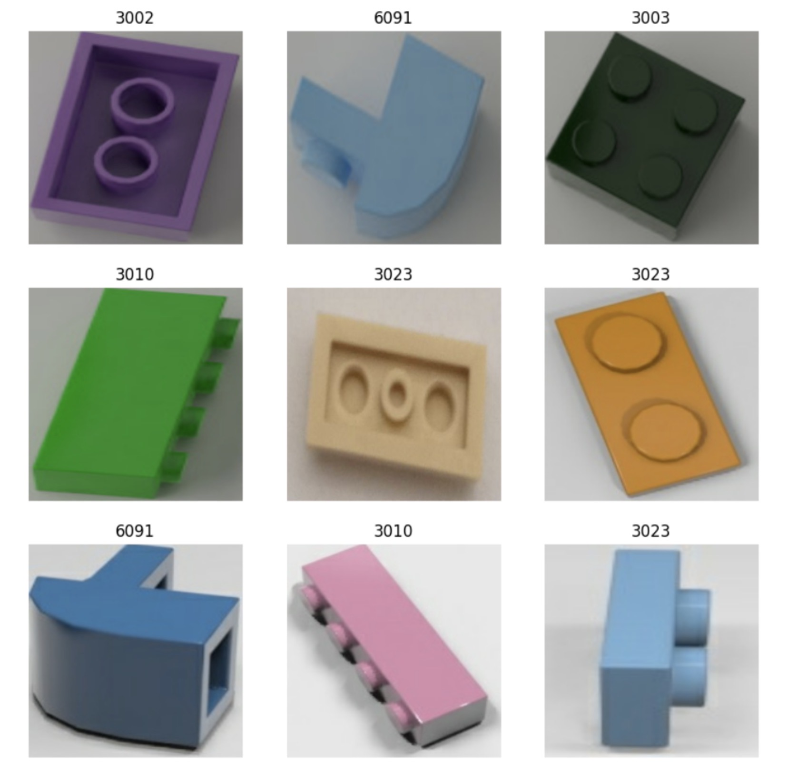

# Smart-LEGO-Sorting-Machine
Project & Contribution Statement

This project was a final year group project completed by a team of four at HKU SPACE Community College (Sep 2025 – Apr 2026). The full system — a desktop semi-automated LEGO sorting machine — was the result of the whole team’s work.

My contribution (LING Lihe / John Ling):

	•	Shape recognition model: dataset preparation, transfer learning and fine-tuning of a MobileNetV3-Large classifier in TensorFlow/Keras (trained on Google Colab), and evaluation
	•	On-device deployment of the trained model on a Raspberry Pi 4B, including runtime environment setup
	•	On-device software: the touchscreen GUI and the classifier scripts connecting model output to the sorting logic

Handled by my teammates: the mechanical structure (vibratory singulation chute, conveyor and outlet mechanism) and the electronic control sub-system etc.

The materials in this repository cover my own part of the project. Results shown here reflect the system as jointly built by the team.

Abstract

This project addresses the core pain point of time-consuming manual LEGO brick sorting in home and educational settings, where existing automated sorting solutions are often bulky, costly, and difficult for non-technical users to replicate. To fill this gap, we design and implement an ultra-compact, low-cost desktop intelligent LEGO sorting system based on the Raspberry Pi 4B embedded platform.

The system adopts a two-layer vibratory singulation mechanism: an upper inclined chute driven by a vibrator separates stacked bricks, which then slide down to a lower conveyor belt and are transported to a controlled imaging zone with a side-mounted fixed-position camera. A touchscreen interface allows users to select either Color Sorting Mode or Shape Sorting Mode, and then choose the six target categories for that run. All recognition and inference are performed entirely on-device without cloud dependency.

Algorithmically, the system uses MobileNetV3Large, a lightweight CNN architecture optimized for embedded devices, to balance recognition accuracy and inference efficiency. For color classification, the model is trained on 3D-rendered multi-shape samples to eliminate interference from part geometry on color feature extraction. For shape classification, the model is pre-trained on a dataset of 17 official LEGO part types with over 36,000 images, then fine-tuned for the core part types used in the demonstration scenario to improve generalization. The final classification system can choose 7 categories for both modes: 6 standard LEGO color families + 1 non-standard color fallback class for color mode, or 6 core official LEGO part models + 1 non-specified part fallback class for shape mode.

The project has completed end-to-end prototype implementation and full functional validation, with core performance metrics as follows:

· Form factor: 1.2cm thick base with a footprint of only 50cm × 25cm, fully compliant with desktop use requirements

· Recognition performance: 93.33% accuracy for color classification in 30 consecutive manual random placement tests, meeting the preset target of ≥90%; 86.67% accuracy for shape classification in offline tests under a fixed controlled environment, and 70% accuracy in 30 random placement demonstration tests, with errors mainly caused by part pose and imaging angle deviations from manual placement

· Inference efficiency: Pure model forward inference time on Raspberry Pi is ≤50ms per frame, far exceeding the preset target of ≤100ms; end-to-end full recognition pipeline time is ≤1s

· Cost control: Total final hardware cost of HKD 1,580, with a low-cost alternative design available to bring the total within the original HKD 1,540 budget

Shape Recognition Model Implementation

Dataset
The shape model was trained on the Images of LEGO Bricks dataset published by Gdańsk University of Technology on the Most Wiedzy open-data platform. The dataset contains both 3D-rendered images (the majority — several thousand per class) and a smaller number of real photographs (a few hundred per class). Seventeen LEGO part numbers were selected to cover the most common bricks, plates, slopes, tiles, and Technic axles relevant to this project. 
The dataset was pre-split into three disjoint subsets and copied into the training environment:
Table 5.4. Shape dataset split
Split	Split Number of images
Training	29,184
Validation	6,242
Test	6,288
Total	41,714

All 17 classes are present in every split. The 17 LEGO part numbers used as class labels are: 11212, 11477, 2420, 2431, 3001, 3002, 3003, 3004, 3005, 3009, 3010, 3021, 3023, 3039, 3623, 3666, 6091.
Images were loaded with tf.keras.utils.image_dataset_from_directory at the native MobileNetV3Large input size of 224×224×3, in batches of 32, with a fixed seed of 42.

